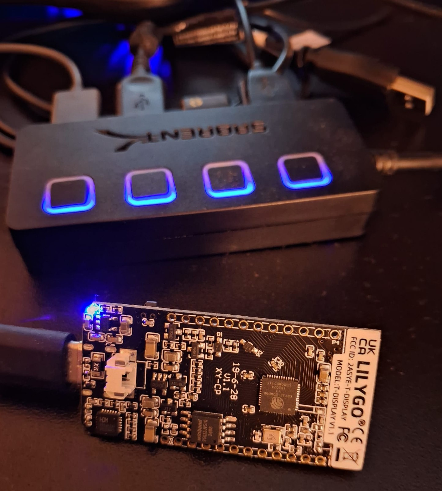

# AOPi3
Third Generation Open Source Radionics

## Connection to External Hardware
### ESP32 TRNG
Like the AetherOnePi this digital radionics "device", a virtual device (yet it works), can use the so called "hotbits" (true random numbers) generated by an external piece of hardware. The ESP32 is cheap enough and even more efficient that dedicated TRNGs for cryptography. Hotbits are used for analysis, also during broadcast for resonance checks.

Work in progress
