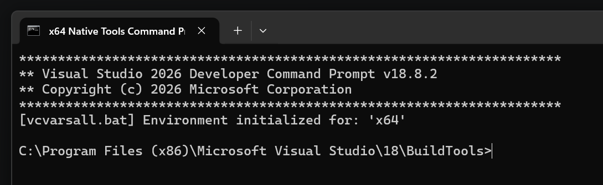
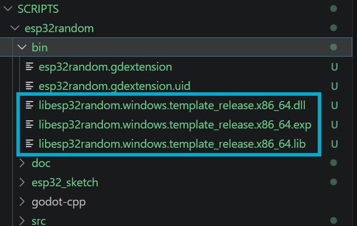

# ESP32Random – GDExtension for Godot 4.7.1

Reads raw random bytes from an ESP32 over the USB serial connection
and exposes them in GDScript as unsigned random numbers in any range
[min, max] (using rejection sampling, so no modulo bias).

## 1. Overview

You need to compile this GDExtension yourself before Godot can load
it — Godot only *loads* pre-built native libraries via `.gdextension`
files, it does not compile C++ source code at runtime. See the FAQ at
the bottom if you're wondering why.

To compile it you need three things:
1. A C++ compiler
2. Python 3 + SCons (the build tool used by Godot and godot-cpp)
3. Git (to fetch the godot-cpp bindings)

Below are detailed, platform-specific instructions for getting all of
these installed.

## 2. Installing the required tools

### Windows

1. **C++ compiler (MSVC Build Tools)**
   Download "Build Tools for Visual Studio" from:
   https://visualstudio.microsoft.com/visual-cpp-build-tools/
   Run the installer and, in the workload selection screen, check
   **"Desktop development with C++"**. This installs `cl.exe`
   (MSVC), the Windows SDK, and everything else needed to build
   native libraries. You don't need the full Visual Studio IDE for
   this — the Build Tools are enough.

2. **Python 3**
   Download from: https://www.python.org/downloads/windows/
   During installation, make sure to check **"Add python.exe to
   PATH"** on the first installer screen — otherwise `python` and
   `pip` won't be available in a normal terminal afterwards.

3. **SCons**
   Open a terminal (PowerShell or CMD) after installing Python and run:
   ```
   py -m pip install scons 

   # then you will see
   Successfully installed scons-4.10.1
   ```

4. **Git**
   Download from: https://git-scm.com/download/win
   Default installer options are fine.

5. **Build environment**
   You must run the build commands from a terminal that has the MSVC
   compiler on its PATH. The easiest way: open the Start Menu and
   launch **"x64 Native Tools Command Prompt for VS 2022"** (installed
   automatically together with the Build Tools). 
   
   

   There type ...

   ````shell
   py -m SCons platform=windows target=template_debug
   # and
   py -m SCons platform=windows target=template_release
   `````
   And this builds the C++ into executables (DLL) for Windows.

   

### Linux (Debian/Ubuntu-based, e.g. via apt)

1. **C++ compiler + build essentials**
   ```
   sudo apt update
   sudo apt install build-essential
   ```
   This installs `g++`, `make`, and related tools.

2. **Python 3 + pip**
   Usually already preinstalled. If not:
   ```
   sudo apt install python3 python3-pip
   ```

3. **SCons**
   ```
   pip3 install scons
   ```
   (If `scons` isn't found afterwards, make sure `~/.local/bin` is in
   your `PATH`, or install it via `sudo apt install scons` instead.)

4. **Git**
   ```
   sudo apt install git
   ```

For other distributions, install the equivalent packages via your
package manager (e.g. `sudo dnf groupinstall "Development Tools"` on
Fedora, or `sudo pacman -S base-devel python git` on Arch), then
`pip install scons`.

### macOS (for completeness)

1. Install Xcode Command Line Tools (provides `clang`):
   ```
   xcode-select --install
   ```
2. Install Python 3 (e.g. via https://www.python.org/downloads/macos/
   or `brew install python`), then:
   ```
   pip3 install scons
   ```
3. Git is included with the Command Line Tools above.

## 3. Fetching godot-cpp

Inside the `esp32random/` folder (where `SConstruct` lives), run:

```bash
git clone --recurse-submodules -b 4.2 https://github.com/godotengine/godot-cpp.git
```

The `4.2` branch of godot-cpp is compatible with Godot 4.1–4.7 (the
bindings are forward/backward compatible within the 4.x API). If you
want to be extra safe, use whichever branch matches your Godot
version most closely, e.g. `4.7` if that branch exists at the time you
clone.

This step downloads the full godot-cpp source and its submodules,
which can take a few minutes depending on your connection.

## 4. Compiling

From the `esp32random/` folder:

**Windows** (in the "x64 Native Tools Command Prompt for VS 2022"):
```
scons platform=windows target=template_debug
scons platform=windows target=template_release
```

**Linux**:
```bash
scons platform=linux target=template_debug
scons platform=linux target=template_release
```

**macOS**:
```bash
scons platform=macos target=template_debug
scons platform=macos target=template_release
```

Building both `template_debug` and `template_release` is
recommended: Godot uses the debug build while you're working in the
editor, and the release build when you export your finished game.

The compiled libraries are placed automatically in `bin/`, matching
the paths already configured in `bin/esp32random.gdextension`.

Troubleshooting:
- **`scons: command not found`** → SCons isn't on your PATH; try
  `python -m SCons ...` instead, or reinstall with `pip install
  --user scons` and add the printed script directory to PATH.
- **Windows: `cl.exe not found` / `error: Microsoft Visual C++ ... not
  found`** → you're not running from the "x64 Native Tools Command
  Prompt for VS 2022"; open that instead of a plain terminal.
- **Linux: `fatal error: Python.h: No such file`** → rare with SCons
  builds, but if it appears install `python3-dev`.

## 5. Integrating into your Godot project

Copy the entire `bin/` folder (including `esp32random.gdextension`
and the compiled `.so` / `.dll` / `.framework` files) into your Godot
project directory, e.g.:

```
res://bin/
```

Godot 4.7.1 will automatically detect the `.gdextension` file the
next time the project is opened or reloaded (reload the editor if
needed). The `ESP32Random` class is then globally available in every
GDScript — no `preload()` needed.

## 6. Usage in GDScript

See `example_usage.gd`. Short version:

```gdscript
var esp := ESP32Random.new()
esp.open_port("/dev/ttyUSB0", 921600)   # Windows: "COM5"

var number := esp.get_random_int(0, 1000)              # a single number
var series := esp.get_random_int_array(0, 1000, 20)    # 20 numbers as PackedInt32Array
var raw := esp.get_random_bytes(16)                     # 16 raw random bytes
var f := esp.get_random_float()                         # float in [0, 1)

esp.close_port()
```

## 7. Notes

- **Finding the port name:** on Linux it's usually `/dev/ttyUSB0` or
  `/dev/ttyACM0` (compare `ls /dev/tty*` before/after plugging in),
  on macOS `/dev/cu.usbserial-XXXX` (`ls /dev/cu.*`), on Windows
  `COM3`, `COM5`, etc. (check Device Manager).
- **Linux permissions:** your user needs access to the port, usually
  `sudo usermod -a -G dialout $USER` is enough (log out and back in
  afterwards).
- **Baud rate:** must exactly match `Serial.begin(921600)` in the
  sketch.
- **Blocking behavior:** `get_random_int()` etc. wait (with a timeout,
  currently ~2–3 s) until enough bytes have arrived. Don't call these
  directly in `_process()` for large amounts of numbers — do it once
  at startup, or in a thread/await, if you need a lot of numbers.
- **Rejection sampling:** for non-power-of-two ranges (e.g. 0–1000),
  4 bytes are occasionally discarded to guarantee an exact uniform
  distribution instead of accepting modulo bias. This only rarely
  costs an extra read attempt.

## 8. FAQ: Why doesn't Godot compile this itself?

Godot is itself just a pre-built executable — it doesn't ship with a
C++ compiler that could translate arbitrary source code at runtime,
the same way a web browser can't compile C++ code you hand it.

GDExtension is a plugin system, not a "Godot builds your code for
you" system: the `.gdextension` file tells Godot to load an
*already-compiled* `.so`/`.dll` as a plugin, calling into it through a
fixed C ABI. This is intentional, because:

- you don't need to build Godot itself from source just to use custom
  native extensions (that would only be required for custom
  modules/engine forks — a much more involved approach)
- your extension can be rebuilt and updated independently of the
  Godot release
- the library has to exactly match your target platform
  (Linux/Windows/macOS, x86_64/ARM, Debug/Release) — only a compiler
  on your machine can produce that, not the editor at runtime

You compile once (or after every code change); Godot then just loads
the finished file — similar to how a DLL plugin works for other
applications.

## Included files

- `src/` – C++ source code of the GDExtension
- `SConstruct` – build script
- `bin/esp32random.gdextension` – configuration file loaded by Godot
- `esp32_sketch/esp32_sketch.ino` – your original ESP32 sketch (unchanged)
- `example_usage.gd` – example script for Godot
